# System Cost Management Integration Plan

## Executive Summary

The Matanuska fleet management platform currently has **three separate system cost components** with overlapping functionality. This document outlines a comprehensive integration plan to unify these components into a robust, scalable system that ensures consistent cost calculation, proper audit trails, and seamless user experience.

## Current State Analysis

### Component Overview

| Component | Location | Purpose | Status |
|-----------|----------|---------|--------|
| **SystemCostsModal** | `/src/components/Models/Trips/SystemCostsModal.tsx` | Modal for trip cost generation | ⚠️ Hardcoded rates |
| **SystemCostGenerator** | `/src/components/SystemCostGenerator.tsx` | Advanced cost generation | 🔄 Partial integration |
| **SystemCostGenerator** | `/src/pages/trips/SystemCostGenerator.tsx` | Simple page-level generator | ❌ Basic implementation |

### Current Architecture Issues

```mermaid
graph TD
    A[SystemCostsModal] --> D[Hardcoded Rates]
    B[SystemCostGenerator] --> E[DEFAULT_SYSTEM_COST_RATES]
    C[SystemCostGenerator Page] --> F[defaultTripWorkflowConfig]

    D --> G[Inconsistent Calculations]
    E --> G
    F --> G

    G --> H[❌ Data Integrity Issues]
    G --> I[❌ Maintenance Overhead]
    G --> J[❌ Poor User Experience]
```



## Component Analysis

### 1. SystemCostsModal.tsx
**Functionality**: Trip cost generation modal interface

#### Current Implementation
```typescript
interface SystemCostsModalProps {
  isOpen: boolean;
  onClose: () => void;
  tripData: Trip;
  onGenerateCosts?: (costs: Omit<CostEntry, "id" | "attachments">[]) => Promise<void>;
}
```

#### Features
- ✅ **Clean UI**: Well-designed modal with detailed cost breakdown
- ✅ **Calculation Logic**: Proper per-km and per-day cost calculations
- ✅ **Cost Categories**: Comprehensive cost types (insurance, tracking, wages, etc.)
- ❌ **Hardcoded Rates**: All rates are fixed in code
- ❌ **Single Currency**: Only supports ZAR
- ❌ **No Backend**: No integration with configuration system

#### Rate Structure
```typescript
// Hardcoded rates in component
const perKmCosts = [
  { type: "Repair & Maintenance per KM", rate: 2.5 },
  { type: "Tyre Cost per KM", rate: 1.8 }
];

const perDayCosts = [
  { type: "GIT Insurance", ratePerDay: 80.0 },
  { type: "Short-Term Insurance", ratePerDay: 60.0 },
  { type: "Tracking Cost", ratePerDay: 40.0 },
  // ... 8 total cost types
];
```

### 2. SystemCostGenerator.tsx (Component)
**Functionality**: Advanced system cost generation with rate management

#### Current Implementation
```typescript
interface SystemCostGeneratorProps {
  trip: Trip;
  onGenerateSystemCosts: (systemCosts: Omit<CostEntry, "id" | "attachments">[]) => void;
}
```

#### Features
- ✅ **Multi-Currency**: Supports USD and ZAR
- ✅ **Rate Versioning**: Tracks rate effective dates and updates
- ✅ **AppContext Integration**: Accesses global application state
- ✅ **Historical Rate Logic**: Attempts to use rates from similar trips
- ❌ **Complex Rate Retrieval**: Overly complicated rate resolution
- ❌ **Incomplete Backend**: Uses DEFAULT_SYSTEM_COST_RATES fallback

#### Rate Management Approach
```typescript
const getApplicableRates = (currency: "USD" | "ZAR"): SystemCostRates => {
  const rates = systemRates[currency];
  const tripStartDate = new Date(trip.startDate);
  const rateEffectiveDate = new Date(rates.effectiveDate);

  // Rate versioning logic (incomplete implementation)
  if (tripStartDate >= rateEffectiveDate) {
    return rates;
  }
  return rates; // Fallback to current rates
};
```

### 3. SystemCostGenerator.tsx (Page)
**Functionality**: Simple trip-level cost generation

#### Current Implementation
```typescript
interface SystemCostGeneratorProps {
  trip: Trip;
  rates?: typeof defaultTripWorkflowConfig.systemRates;
  onGenerate: (costs: SystemCost[]) => void;
}
```

#### Features
- ✅ **Simple Implementation**: Easy to understand and maintain
- ✅ **Config-Based**: Uses centralized configuration
- ✅ **Regeneration**: Allows cost recalculation
- ❌ **Limited Functionality**: Basic cost types only
- ❌ **No Persistence**: No backend integration
- ❌ **Simplified Data Model**: Different cost structure

#### Cost Types
```typescript
// Simplified cost structure
interface SystemCost {
  id: string;
  type: "repair" | "tyre" | "git" | "fuel" | "driver";
  description: string;
  amount: number;
  calculation: string;
  isSystemGenerated: true;
}
```

## Integration Strategy

### Unified Architecture


### Core Service Implementation

```typescript
// src/services/SystemCostService.ts
export class SystemCostService {
  constructor(
    private rateManager: RateManager,
    private costCalculator: CostCalculator,
    private auditLogger: AuditLogger
  ) {}

  /**
   * Generate system costs for a trip
   */
  async generateSystemCosts(
    trip: Trip,
    options: {
      rateOverride?: Partial<SystemCostRates>;
      effectiveDate?: Date;
      includeAudit?: boolean;
    } = {}
  ): Promise<CostEntry[]> {
    try {
      // 1. Get applicable rates
      const rates = await this.rateManager.getRates(
        trip.revenueCurrency,
        options.effectiveDate || new Date(trip.startDate)
      );

      // 2. Apply overrides if provided
      const finalRates = options.rateOverride
        ? { ...rates, ...options.rateOverride }
        : rates;

      // 3. Calculate costs
      const costs = await this.costCalculator.calculate(trip, finalRates);

      // 4. Log audit trail
      if (options.includeAudit) {
        await this.auditLogger.logCostGeneration(trip.id, costs, finalRates);
      }

      return costs;
    } catch (error) {
      throw new SystemCostGenerationError(
        `Failed to generate system costs for trip ${trip.id}: ${error.message}`
      );
    }
  }

  /**
   * Batch cost generation for multiple trips
   */
  async generateBulkSystemCosts(
    trips: Trip[],
    progressCallback?: (completed: number, total: number) => void
  ): Promise<Map<string, CostEntry[]>> {
    const results = new Map<string, CostEntry[]>();

    for (let i = 0; i < trips.length; i++) {
      const trip = trips[i];
      try {
        const costs = await this.generateSystemCosts(trip);
        results.set(trip.id, costs);
      } catch (error) {
        console.error(`Failed to generate costs for trip ${trip.id}:`, error);
        results.set(trip.id, []);
      }

      progressCallback?.(i + 1, trips.length);
    }

    return results;
  }

  /**
   * Preview system costs without persistence
   */
  async previewSystemCosts(
    tripData: Partial<Trip>,
    currency: 'USD' | 'ZAR'
  ): Promise<SystemCostPreview> {
    const mockTrip: Trip = {
      id: 'preview',
      revenueCurrency: currency,
      ...tripData
    } as Trip;

    const rates = await this.rateManager.getRates(currency);
    const costs = await this.costCalculator.calculate(mockTrip, rates);

    return {
      costs,
      total: costs.reduce((sum, cost) => sum + cost.amount, 0),
      breakdown: this.costCalculator.getBreakdown(costs),
      rateVersion: rates.version
    };
  }
}
```

### Rate Management System

```typescript
// src/services/RateManager.ts
export class RateManager {
  private cache = new Map<string, SystemCostRates>();
  private readonly CACHE_TTL = 5 * 60 * 1000; // 5 minutes

  /**
   * Get rates for a specific currency and date
   */
  async getRates(
    currency: 'USD' | 'ZAR',
    effectiveDate: Date = new Date()
  ): Promise<SystemCostRates> {
    const cacheKey = `${currency}-${effectiveDate.toISOString().split('T')[0]}`;

    // Check cache first
    if (this.cache.has(cacheKey)) {
      const cached = this.cache.get(cacheKey)!;
      if (Date.now() - new Date(cached.lastAccessed).getTime() < this.CACHE_TTL) {
        return cached;
      }
    }

    // Fetch from Firestore
    const rates = await this.fetchRatesFromFirestore(currency, effectiveDate);

    // Update cache
    this.cache.set(cacheKey, {
      ...rates,
      lastAccessed: new Date().toISOString()
    });

    return rates;
  }

  /**
   * Update rates with audit trail
   */
  async updateRates(
    currency: 'USD' | 'ZAR',
    rates: Omit<SystemCostRates, 'version' | 'lastUpdated' | 'updatedBy'>,
    updateInfo: {
      reason: string;
      updatedBy: string;
      effectiveDate?: Date;
    }
  ): Promise<SystemCostRates> {
    const newVersion = this.generateVersion();
    const now = new Date();

    const updatedRates: SystemCostRates = {
      ...rates,
      currency,
      version: newVersion,
      lastUpdated: now.toISOString(),
      updatedBy: updateInfo.updatedBy,
      effectiveDate: (updateInfo.effectiveDate || now).toISOString(),
      changeReason: updateInfo.reason
    };

    // Save to Firestore
    await this.saveRatesToFirestore(updatedRates);

    // Clear cache
    this.clearCacheForCurrency(currency);

    // Log audit trail
    await this.logRateChange(currency, rates, updatedRates, updateInfo);

    return updatedRates;
  }

  private async fetchRatesFromFirestore(
    currency: 'USD' | 'ZAR',
    effectiveDate: Date
  ): Promise<SystemCostRates> {
    const ratesRef = collection(db, 'systemCostRates', currency, 'versions');
    const q = query(
      ratesRef,
      where('effectiveDate', '<=', effectiveDate.toISOString()),
      orderBy('effectiveDate', 'desc'),
      limit(1)
    );

    const snapshot = await getDocs(q);

    if (snapshot.empty) {
      // Return default rates if none found
      return DEFAULT_SYSTEM_COST_RATES[currency];
    }

    return snapshot.docs[0].data() as SystemCostRates;
  }

  private generateVersion(): string {
    return `v${Date.now()}-${Math.random().toString(36).substr(2, 5)}`;
  }
}
```

### Unified Component Interface

```typescript
// src/components/SystemCost/SystemCostGenerator.tsx
interface SystemCostGeneratorProps {
  trip: Trip | Partial<Trip>;
  mode: 'modal' | 'inline' | 'preview';
  onGenerate?: (costs: CostEntry[]) => Promise<void>;
  onPreview?: (preview: SystemCostPreview) => void;
  options?: {
    showRateInfo?: boolean;
    allowRateOverride?: boolean;
    enableBatchMode?: boolean;
    customRates?: Partial<SystemCostRates>;
  };
}

export const SystemCostGenerator: React.FC<SystemCostGeneratorProps> = ({
  trip,
  mode,
  onGenerate,
  onPreview,
  options = {}
}) => {
  const systemCostService = useSystemCostService();
  const [costs, setCosts] = useState<CostEntry[]>([]);
  const [isGenerating, setIsGenerating] = useState(false);
  const [preview, setPreview] = useState<SystemCostPreview | null>(null);

  // Mode-specific rendering
  const renderContent = () => {
    switch (mode) {
      case 'modal':
        return <SystemCostModal {...props} />;
      case 'inline':
        return <SystemCostInline {...props} />;
      case 'preview':
        return <SystemCostPreview {...props} />;
      default:
        return <SystemCostInline {...props} />;
    }
  };

  return (
    <div className={`system-cost-generator mode-${mode}`}>
      {renderContent()}
    </div>
  );
};
```

## Data Models

### SystemCostRates Interface
```typescript
interface SystemCostRates {
  currency: 'USD' | 'ZAR';
  version: string;
  effectiveDate: string;
  lastUpdated: string;
  updatedBy: string;
  changeReason?: string;

  perKmCosts: {
    repairMaintenance: number;
    tyreCost: number;
  };

  perDayCosts: {
    gitInsurance: number;
    shortTermInsurance: number;
    trackingCost: number;
    fleetManagementSystem: number;
    licensing: number;
    vidRoadworthy: number;
    wages: number;
    depreciation: number;
  };
}
```

### CostEntry Interface (Enhanced)
```typescript
interface CostEntry {
  id: string;
  tripId: string;
  category: string;
  subCategory: string;
  amount: number;
  currency: 'USD' | 'ZAR';
  referenceNumber: string;
  date: string;
  notes?: string;
  attachments: string[];

  // System cost specific fields
  isSystemGenerated: boolean;
  systemCostType?: 'per-km' | 'per-day';
  calculationDetails?: string;
  rateVersion?: string;

  // Audit fields
  isFlagged: boolean;
  flagReason?: string;
  flaggedAt?: string;
  flaggedBy?: string;
}
```

## Database Schema

### Firestore Collections

#### System Cost Rates
```
/systemCostRates/{currency}/versions/{versionId}
{
  currency: 'USD' | 'ZAR',
  version: string,
  effectiveDate: Timestamp,
  lastUpdated: Timestamp,
  updatedBy: string,
  changeReason: string,
  perKmCosts: {...},
  perDayCosts: {...}
}
```

#### Rate Change Audit
```
/systemCostAudit/{auditId}
{
  timestamp: Timestamp,
  currency: 'USD' | 'ZAR',
  action: 'create' | 'update' | 'delete',
  oldRates: SystemCostRates,
  newRates: SystemCostRates,
  updatedBy: string,
  reason: string,
  affectedTrips?: string[]
}
```

#### Cost Generation Log
```
/costGenerationLog/{logId}
{
  timestamp: Timestamp,
  tripId: string,
  costsGenerated: number,
  totalAmount: number,
  currency: 'USD' | 'ZAR',
  rateVersion: string,
  generatedBy: string,
  calculationTime: number
}
```

## Implementation Phases

### Phase 1: Foundation (Weeks 1-2)
- [ ] Create SystemCostService with core functionality
- [ ] Implement RateManager with Firestore integration
- [ ] Set up database schema and security rules
- [ ] Create comprehensive type definitions
- [ ] Implement basic error handling and logging

### Phase 2: Component Unification (Weeks 3-4)
- [ ] Create unified SystemCostGenerator component
- [ ] Implement modal, inline, and preview modes
- [ ] Migrate SystemCostsModal functionality
- [ ] Update SystemCostConfiguration for backend integration
- [ ] Add comprehensive form validation

### Phase 3: Advanced Features (Weeks 5-6)
- [ ] Implement batch cost generation
- [ ] Add rate history and rollback functionality
- [ ] Create cost optimization recommendations
- [ ] Implement real-time rate synchronization
- [ ] Add comprehensive audit reporting

### Phase 4: Testing & Deployment (Weeks 7-8)
- [ ] Unit tests for all calculation logic
- [ ] Integration tests with Firestore
- [ ] E2E tests for complete workflows
- [ ] Performance testing and optimization
- [ ] Documentation and training materials

## Migration Strategy

### Backward Compatibility
```typescript
// Legacy component wrappers for smooth transition
export const LegacySystemCostsModal = (props: LegacySystemCostsModalProps) => {
  return (
    <SystemCostGenerator
      mode="modal"
      trip={props.tripData}
      onGenerate={props.onGenerateCosts}
    />
  );
};
```

### Data Migration Scripts
```typescript
// Migrate existing cost entries to new format
export async function migrateLegacySystemCosts() {
  const trips = await getTripsWithSystemCosts();

  for (const trip of trips) {
    const legacyCosts = trip.costs.filter(c => c.isSystemGenerated);

    for (const cost of legacyCosts) {
      await updateCostEntry(cost.id, {
        ...cost,
        rateVersion: 'legacy',
        calculationDetails: generateLegacyCalculationDetails(cost)
      });
    }
  }
}
```

## Testing Strategy

### Unit Tests
```typescript
describe('SystemCostService', () => {
  describe('generateSystemCosts', () => {
    it('should calculate correct per-km costs', async () => {
      const trip = createMockTrip({ distanceKm: 100 });
      const rates = createMockRates({ repairMaintenance: 2.5 });

      const costs = await systemCostService.generateSystemCosts(trip);

      expect(costs.find(c => c.subCategory === 'Repair & Maintenance per KM'))
        .toHaveProperty('amount', 250);
    });
  });
});
```

### Integration Tests
```typescript
describe('Rate Management Integration', () => {
  it('should fetch rates from Firestore', async () => {
    await seedFirestoreWithRates();

    const rates = await rateManager.getRates('USD', new Date());

    expect(rates).toMatchObject({
      currency: 'USD',
      perKmCosts: expect.any(Object),
      perDayCosts: expect.any(Object)
    });
  });
});
```

## Performance Considerations

### Caching Strategy
- **Rate Caching**: 5-minute TTL for frequently accessed rates
- **Calculation Caching**: Cache calculation results for identical trips
- **Batch Processing**: Optimize bulk operations with parallel processing

### Database Optimization
- **Compound Indexes**: For efficient rate queries by currency and date
- **Data Partitioning**: Separate historical data from active rates
- **Connection Pooling**: Optimize Firestore connection usage

## Security Measures

### Access Control
```typescript
// Firestore security rules
rules_version = '2';
service cloud.firestore {
  match /databases/{database}/documents {
    match /systemCostRates/{currency}/versions/{version} {
      allow read: if request.auth != null;
      allow write: if request.auth != null
        && request.auth.token.role in ['admin', 'manager'];
    }
  }
}
```

### Audit Trail
- All rate changes logged with user information
- Cost generation tracked with timestamps
- Failed operations logged for debugging
- Rate access patterns monitored for security

## Monitoring & Analytics

### Key Metrics
- **Cost Generation Performance**: Average calculation time
- **Rate Usage Patterns**: Most frequently used rates
- **Error Rates**: Failed cost generations by cause
- **User Adoption**: Usage patterns across different components

### Alerting
- Rate calculation failures
- Unusual cost generation patterns
- Performance degradation
- Security anomalies

## Success Criteria

### Technical Goals
- ✅ 100% test coverage for calculation logic
- ✅ < 2 second average cost generation time
- ✅ Zero data loss during migration
- ✅ 99.9% uptime for cost generation service

### Business Goals
- ✅ Consistent cost calculations across all interfaces
- ✅ Audit-compliant rate management
- ✅ Reduced maintenance overhead (single codebase)
- ✅ Improved user experience with unified interface

## Risk Mitigation

### Technical Risks
- **Data Integrity**: Comprehensive validation and rollback procedures
- **Performance**: Load testing and optimization strategies
- **Migration Issues**: Phased rollout with rollback plans

### Business Risks
- **User Adoption**: Training programs and gradual migration
- **Compliance**: Audit trail preservation during migration
- **Operational Impact**: Minimal downtime deployment strategy

## Conclusion

This integration plan provides a comprehensive roadmap for unifying the three system cost components into a robust, scalable solution. The phased approach ensures minimal disruption while delivering significant improvements in consistency, maintainability, and user experience.

The unified system will serve as the foundation for future enhancements, including advanced analytics, machine learning-based rate optimization, and integration with external accounting systems.

---

*Document Version: 1.0*
*Last Updated: September 3, 2025*
*Author: System Architecture Team*
